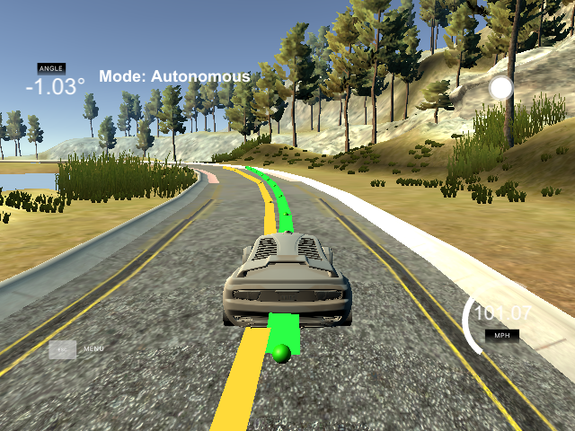

# Model Predictive Controls Project
Self-Driving Car Engineer Nanodegree Program

**The goal of this project is to use a model predictive controller to drive a car around the Udacity simulators lake-track, while also handling latency in the controls.**

## Result
The car successfully drives around the track without leaving the road, but crossing the lane lines. The minimum car speed is >~60 and the maximum car speed is just over 100.

## Vehicle model
The vehicle model used was the global kinematic model discussed in the lessons.
* Variables :
  - **r** = (rx, ry) : car position
  - &psi; : car orientation
  - v : speed; _**v** = v(cos(&psi;), sin(&psi;))_
  - cte : cross-track error
  - e&psi; : the error in the car orientation
  - &delta; : car steering control
  - a : car acceleration
  - Lf : distance between the front of the car and the center of gravity
  - dt : time step
  - f(x) : polynomial describing the path we want to follow
* Car state : **x** = (rx, ry, &psi;, v, cte, e&psi;)
* Actuators : **u** = (&delta;, a)
* Update equations :
  - **r**t+1 = **r**t + **v**t  dt
  - &psi;t+1 = &psi;t + vt * &delta;t * dt / Lf
  - vt+1 = vt + at dt
  - ctet+1 = f(xt) - yt + vt sin(e&psi;t) dt
  - e&psi;t+1 = &psi;t - atan(df/dx)|xt + vt * &delta;t * dt / Lf
* Constraints :
  - &delta; &in; [-25&deg;, 25&deg;]
  - a &in; [-1, 1]

## Model cost function
The cost, C, I used to optimize the actuator values has three terms.
* The direct error given by the cross-track error and orientation error (in degrees)
  - Cdirect, t = (t+1) wcte ctet2 + we&psi; e&psi;t2.

  The (t+1) term on the cte error weights the error more heavily at time steps further into the future, and the orientation error is put in units of degrees so that the order of magnitudes of the two errors are closer.
* The derivative of the steering angle (in degrees)
  - Cd&delta;, t = wd&delta; (d&delta;/dt)2.
* A speed control term
  - Cv, t = wv (v - vref)2

  where vref is a reference speed.

#### Cost parameters
The weight factors, w(.) terms, and the reference speed are given by
* wcte = 20
* we&psi; = 20
* wd&delta; = 2 + 80 RoC1/2
* wv = 30
* vref = 20 + 170 RoC

where RoC is the "normalized" radius of curvature of the polynomial fitted to the waypoints and has a value &in; [0,1] (see below). The RoC value is close to zero for sharp turns and close to one on very straight roads. Thus, when driving on a straight road, wd&delta; is very large, which significantly damps out any change in the cars steering angle; however, when the road has a sharp turn, wd&delta; becomes small, allowing for large, but smooth, changes in the steering angle. Likewise, the reference speed is very large when the road is straight, but during a turn, it becomes quite small.

#### Road curvature
If the path we want to travel along (the road) is given by a polynomial f(x), then

  roc &leftarrow; (1 + (df/dx)2)3/2 / |d2f/dx2|  
  RoC &leftarrow; min(roc, 500)/500

The radius of curvature is evaluated 25 meters in front of the car's current location; this gives lookahead capabilities.

## Modeled time steps and latency compensation
The number of time-steps modeled was a fixed value of N = 10. This allowed for sufficient resolution, while also decreasing the increased modeling time that comes with modeling more time-steps.

#### Latency compensation
Latency is very simple to compensate for using the MPC because the very first time step is simply set to the expected latency, dt1 = tlatency.

#### Distance controlled time steps

The duration of the remaining N-1 time-steps, dtn>1 [sec], was implicitly set by changing the distance, d [m], in front of the car that was modeled.

d = 50 + 30 RoC - tlatency v0  
dtn>1 = d / ((N-1)*v0 + &epsilon;),  

where RoC is the same as above. This means that, for a straight road, I model 80 m in front of the car, but when the road turns sharply, I only model 50 m in front of the car.

_Note. When I model with a fixed time, dt=0.1, then the car runs off the road._

## Waypoint fitting
The waypoints returned by the simulator were fit with a 3rd order polynomial.
